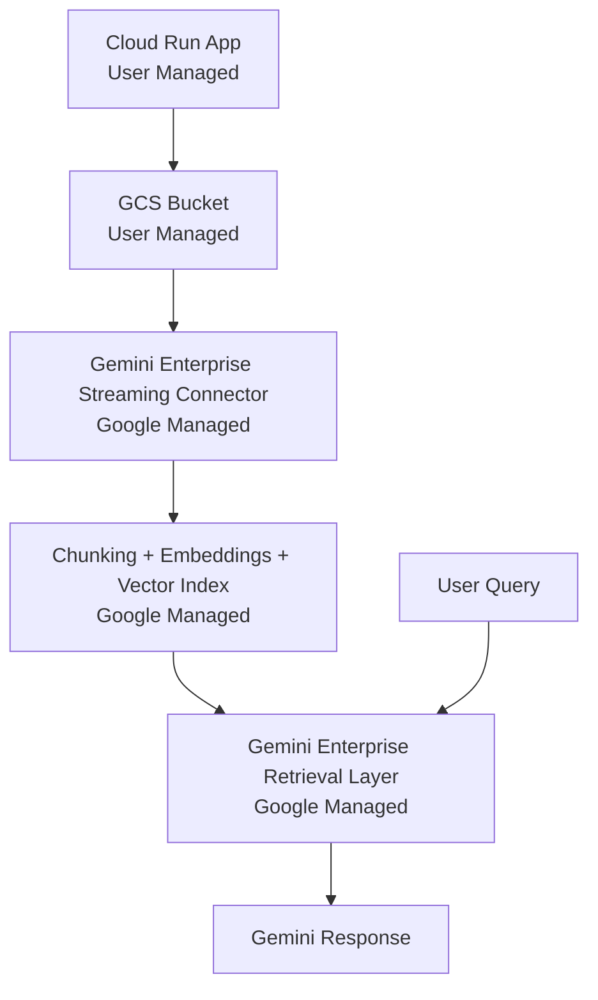
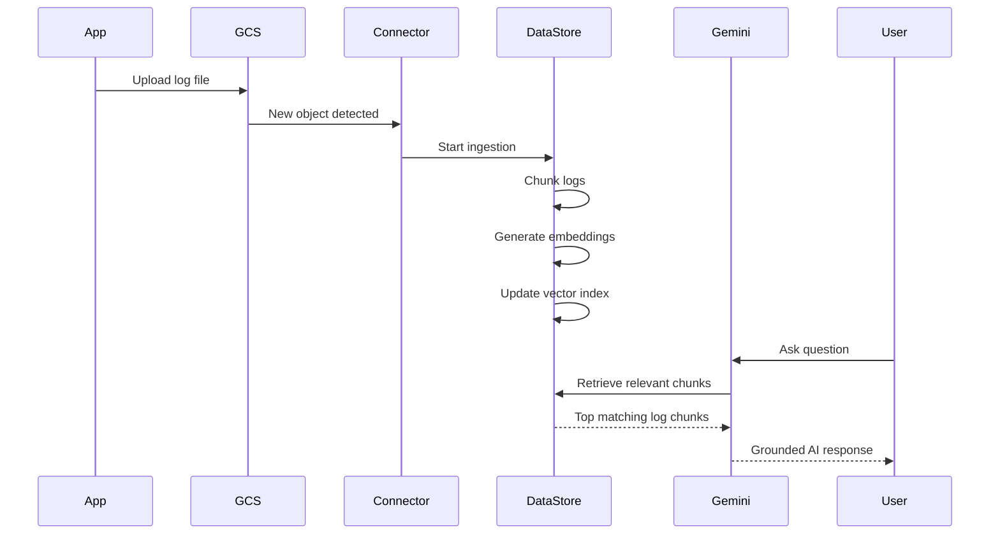
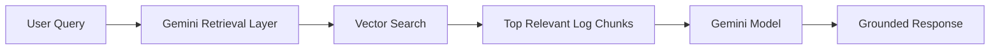

This guide demonstrates a modern **AI-powered observability pipeline** using:

- A lightweight application that generates logs
    
- Google Cloud Storage (GCS) as the ingestion layer
    
- Gemini Enterprise Data Store with Streaming sync
    
- Near real-time indexing and retrieval
    
- Natural language querying using Gemini
    

The goal is:

> Keep the Data Store continuously synced with new logs so users can query operational data using natural language.

---

# 🧠 High-Level Architecture



---

# 🧭 Architecture Breakdown

|Component|Type|Responsibility|
|---|---|---|
|Cloud Run App|User Managed|Generates and uploads logs|
|GCS Bucket|User Managed|Source of truth for log storage|
|Streaming Connector|Google Managed|Detects new files in GCS|
|Data Store Indexing|Google Managed|Chunking + embeddings + vector indexing|
|Gemini Retrieval Layer|Google Managed|Retrieves relevant log chunks|
|Gemini UI/API|Google Managed|Generates grounded responses|

---

# 🧠 How the System Works Internally

When a log file is uploaded:



---

# 🧠 Important Concept — Gemini Does NOT Read Entire Bucket

Even if you store millions of logs:

❌ Gemini does NOT scan the entire bucket during every query.

Instead:

1. Logs are indexed during ingestion
    
2. Embeddings are generated once
    
3. Vector search retrieves only relevant chunks
    
4. Gemini receives only small relevant context
    

Example:

```text
User Query:
"Why did payment service fail today?"

System retrieves:
- DB timeout logs
- Retry failures
- Connection pool exhaustion

NOT:
- Entire bucket contents
```

This keeps:

- token usage low
    
- latency manageable
    
- retrieval scalable
    

---

# ⚡ Final Simplified Architecture

```text
Cloud Run App
      ↓
GCS Bucket (/logs)
      ↓
Gemini Enterprise Streaming Sync
      ↓
Data Store Index
      ↓
Gemini Retrieval Layer
      ↓
User Query
```

---

# 🧱 Step 1 — Configure GCP Project

## Set project

```bash
gcloud config set project YOUR_PROJECT_ID
export PROJECT_ID=$(gcloud config get-value project)
export REGION=global
```

---

## Enable required APIs

```bash
gcloud services enable \
  storage.googleapis.com \
  run.googleapis.com \
  cloudbuild.googleapis.com \
  discoveryengine.googleapis.com \
  aiplatform.googleapis.com
```

---

# 🪣 Step 2 — Create GCS Bucket

```bash
export BUCKET_NAME=${PROJECT_ID}-log-bucket

gcloud storage buckets create gs://${BUCKET_NAME} \
  --location=US \
  --uniform-bucket-level-access
```

---

# 📁 Step 3 — Create Logs Folder

```bash
gcloud storage cp /dev/null gs://${BUCKET_NAME}/logs/.keep
```

Recommended structure:

```text
gs://YOUR_BUCKET/logs/
```

---

# 🧪 Step 4 — Create Sample Log File

```bash
cat <<EOF > db-error.txt
[ERROR] Database connection timeout
[ERROR] Payment service failed to connect to PostgreSQL
[WARNING] Retry attempt failed after 30 seconds
EOF
```

Upload test file:

```bash
gcloud storage cp db-error.txt gs://${BUCKET_NAME}/logs/
```

---

# 🧠 Step 5 — Create Gemini Enterprise Data Store

Open:

```text
https://console.cloud.google.com/gen-app-builder
```

---

## Create Application

Choose:

- Chat application
    
- Enterprise search/chat
    

---

## Configure Data Source

Select:

- Cloud Storage
    
- Documents
    
- Streaming (Preview)
    

Path:

```text
gs://YOUR_BUCKET/logs/
```

---

# 🔐 Step 6 — Grant Discovery Engine Access to Bucket

During setup you may see:

```text
service-XXXX@gcp-sa-discoveryengine.iam.gserviceaccount.com
```

Grant bucket permissions:

```bash
gcloud storage buckets add-iam-policy-binding gs://${BUCKET_NAME} \
  --member="serviceAccount:SERVICE_ACCOUNT" \
  --role="roles/storage.admin"
```

Example:

```bash
gcloud storage buckets add-iam-policy-binding gs://${BUCKET_NAME} \
  --member="serviceAccount:service-123456789@gcp-sa-discoveryengine.iam.gserviceaccount.com" \
  --role="roles/storage.admin"
```

---

# ⚙️ Step 7 — Deploy Log Generator App (Cloud Run)

## Folder structure

```text
app/
  main.py
  requirements.txt
  Dockerfile
```

---

## main.py

```python
from flask import Flask
from google.cloud import storage
import uuid
import datetime
import json
import os

app = Flask(__name__)

BUCKET_NAME = os.environ.get("BUCKET_NAME")
storage_client = storage.Client()

@app.route("/")
def home():
    return "Log App Running"

@app.route("/log")
def generate_log():
    log = {
        "id": str(uuid.uuid4()),
        "service": "payment-api",
        "severity": "ERROR",
        "message": "Database connection timeout",
        "timestamp": str(datetime.datetime.utcnow())
    }

    file_name = f"logs/{log['id']}.json"

    bucket = storage_client.bucket(BUCKET_NAME)
    blob = bucket.blob(file_name)

    blob.upload_from_string(
        json.dumps(log),
        content_type="application/json"
    )

    return {
        "status": "uploaded",
        "file": file_name
    }
```

---

## requirements.txt

```text
flask==3.0.3
google-cloud-storage==2.16.0
gunicorn==22.0.0
```

---

## Dockerfile

```dockerfile
FROM python:3.11-slim

WORKDIR /app

COPY requirements.txt .
RUN pip install --no-cache-dir -r requirements.txt

COPY . .

CMD ["gunicorn", "-b", "0.0.0.0:8080", "main:app"]
```

---

## Deploy Cloud Run App

```bash
export APP_IMAGE=us-central1-docker.pkg.dev/${PROJECT_ID}/apps/log-app

# Create Artifact Registry

gcloud artifacts repositories create apps \
  --repository-format=docker \
  --location=us-central1
```

Build image:

```bash
gcloud builds submit --tag ${APP_IMAGE} ./app
```

Deploy:

```bash
gcloud run deploy log-app \
  --image ${APP_IMAGE} \
  --region us-central1 \
  --allow-unauthenticated \
  --set-env-vars BUCKET_NAME=${BUCKET_NAME}
```

---

# 🧪 Step 8 — Generate Logs

Call the endpoint:

```bash
curl https://YOUR_CLOUD_RUN_URL/log
```

This will:

1. Generate a structured log
    
2. Upload to GCS
    
3. Trigger streaming sync
    
4. Update Data Store index
    

---

# 🔍 Step 9 — Query Logs Using Gemini

Open Gemini Enterprise application.

Example queries:

```text
What database related issues occurred?
```

```text
Summarize payment-api failures.
```

```text
What errors happened in the latest logs?
```

---

# 🧠 What Happens During Query



Gemini only receives:

- relevant chunks
    
- not the entire datastore
    
- not the entire bucket
    

This is what makes RAG scalable.

---

# 🔍 Where to Observe the System

## GCS Bucket

Verify uploaded logs:

```bash
gcloud storage ls gs://${BUCKET_NAME}/logs/
```

---

## Gemini Connected Data Stores

Check:

- indexing status
    
- document count
    
- sync health
    
- ingestion progress
    

---

## Gemini Query UI

Validate retrieval by asking questions about newly uploaded logs.

---

# ⚡ What is Managed by Google vs You

## 🟢 User Managed

You manage:

- Cloud Run application
    
- Log format
    
- GCS bucket
    
- Retention policies
    
- IAM configuration
    

---

## 🔵 Google Managed

Google manages:

- Streaming ingestion detection
    
- Chunking
    
- Embeddings generation
    
- Vector indexing
    
- Semantic retrieval
    
- Gemini grounding
    
- Query orchestration
    

---

# 🚀 Recommended Improvements

## Structured Logs

Prefer:

```json
{
  "service": "payment-api",
  "severity": "ERROR",
  "message": "DB timeout",
  "env": "prod"
}
```

instead of plain text.

---

## Retention Policies

Keep only relevant logs:

```text
30-90 days
```

---

## Reduce Noise

Avoid ingesting:

- health checks
    
- repetitive INFO logs
    
- debug spam
    

---

## Add Metadata

Useful metadata:

- service name
    
- environment
    
- severity
    
- region
    
- incident ID
    

---

# 🧠 Final Takeaway

This architecture provides:

✅ Near real-time AI-powered log search  
✅ Managed RAG infrastructure  
✅ Scalable semantic retrieval  
✅ Minimal operational overhead  
✅ Modern GenAI observability workflow

Most importantly:

> Gemini does not scan your entire bucket during every query.
> 
> The Data Store indexes logs once, retrieves only relevant chunks, and sends small contextual data to Gemini for reasoning.

## Development and review

See [CONTRIBUTING.md](CONTRIBUTING.md) for local checks, configuration handling, and the review workflow.
